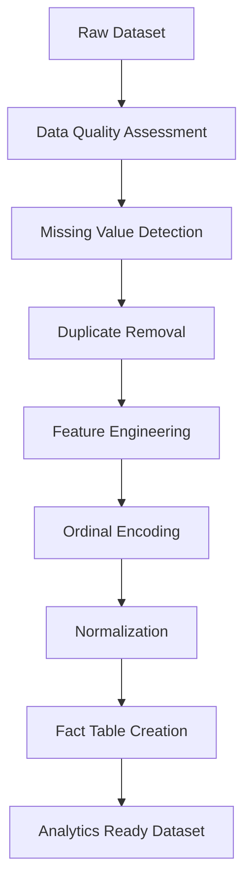

<div align="center">

# 📊 Documentation


</div>

---

## 📌 Project Overview

This project focuses on transforming a raw dataset into an **analytics-ready dataset** through structured preprocessing, quality assessment, feature engineering, and normalization techniques.

The goal is to ensure:

✅ Data consistency  
✅ Improved model performance  
✅ Reliable reporting metrics  
✅ Analytics & BI readiness  
✅ Feature enhancement for ML use cases  

---

# 🏗 Analytics Pipeline



---

# 🔍 Data Quality Summary

| Dataset | Column | Issue | Rows | Magnitude | Solvable | Resolution |
|:---|:---|:---|---:|---:|:---:|:---|
| dataset_transformed | all | Exact duplicate rows | 3 | 0.001% | ✅ | Removed duplicate records |
| dataset_transformed | job_sector | N/A values | 143,356 | 48% | ✅ | Converted `N/A` → `Not Applicable` |
| dataset_transformed | GPA | GPA values above 4.00 | 6,554 | 2.18% | ✅ | Added `GPA_Above_4` flag |
| dataset_transformed | Age & Years_Since_Graduation | Graduation age under 16 | 9,869 | 3.29% | ❌ | Added anomaly flag |
| dataset_transformed | Salary | Null values for unemployed records | 143,356 | 47.79% | ❌ | Added unemployment indicator |
| dataset_transformed | Internship_Experience | Yes/No categorical data | 299,997 | 100% | ✅ | Converted to binary |
| dataset_transformed | Education_Level | Ordinal category | 299,997 | 100% | ✅ | Numeric ranking created |
| dataset_transformed | Language_Proficiency | Ordinal category | 299,997 | 100% | ✅ | Numeric ranking created |
| dataset_transformed | University_Ranking | Ordinal category | 299,997 | 100% | ✅ | Numeric ranking created |
| dataset_transformed | numeric_columns | Different scales | 299,997 | 100% | ✅ | Applied normalization |
| dataset_transformed | Text/Categorical Columns | Spaces & hidden characters | 299,997 | 100% | ✅ | Applied clean + trim |
| fact_table | all | Missing unique ID | 299,997 |100%| ✅ | Generated ID |

---

# ⚙ Feature Engineering

## GPA Validation Rule

```PowerQuery
[GPA] > 4
```

Generated:

```text
GPA_Above_4
```

Purpose:

- Detect invalid GPA values
- Flag outliers
- Preserve original records

---

## Graduation Age Validation

```PowerQuery
[Graduation_Age] < 16
```

Generated:

```text
Grad_Age_Under_16
```

Purpose:

- Identify unrealistic graduation ages
- Improve quality monitoring

---

# 🔤 Ordinal Encoding Rules

## 🎓 Education Level

| Category | Code |
|---|---:|
| Diploma | 1 |
| Bachelor's | 2 |
| Master's | 3 |
| PhD | 4 |

Power Query:

```PowerQuery
if [Education_Level]="Diploma" then 1
else if [Education_Level]="Bachelor's" then 2
else if [Education_Level]="Master's" then 3
else if [Education_Level]="PhD" then 4
else null
```

Generated:

```text
Education_Level_Code
```

---

## 🌐 Language Proficiency

| Category | Code |
|---|---:|
| Basic |1|
| Intermediate |2|
| Advanced |3|
| Fluent |4|

Power Query:

```PowerQuery
if [Language_Proficiency]="Basic" then 1
else if [Language_Proficiency]="Intermediate" then 2
else if [Language_Proficiency]="Advanced" then 3
else if [Language_Proficiency]="Fluent" then 4
else null
```

Generated:

```text
Language_Proficiency_Code
```

---

## 🏛 University Ranking

| Ranking | Code |
|---|---:|
| Low |1|
| Medium |2|
| High |3|

Power Query:

```PowerQuery
if [University_Ranking]="Low" then 1
else if [University_Ranking]="Medium" then 2
else if [University_Ranking]="High" then 3
else null
```

Generated:

```text
University_Ranking_Code
```

---

# 📐 Data Standardization

Normalized columns:

- Age
- Years Since Graduation
- GPA
- Salary

Benefits:

✔ Scale consistency  
✔ Better ML performance  
✔ Reduced feature bias  
✔ Easier comparison  

---

# 🧹 Cleaning Operations

The following preprocessing steps were applied:

```text
✓ Remove duplicate rows
✓ Handle missing values
✓ Standardize text values
✓ Trim spaces
✓ Remove hidden characters
✓ Generate anomaly flags
✓ Encode ordinal categories
✓ Normalize numerical values
✓ Create unique IDs
```

---

# 🆔 Fact Table Enhancements

Generated unique identifier:

```text
GR-000001
GR-000002
GR-000003
...
```

Field created:

```text
Graduated_ID
```

Purpose:

- Establish row uniqueness
- Support star schema design
- Improve data relationships

---

# 📊 Analytics KPIs

Recommended dashboard metrics:

### Employment Analytics
- Employment Rate
- Unemployment Rate
- Salary Distribution

### Education Analytics
- Salary by Education Level
- GPA Distribution
- Degree Trends

### University Analytics
- Ranking Impact on Salary
- Ranking vs Employment

### Internship Analytics
- Internship Conversion Rate
- Experience vs Salary

### Language Analytics
- Language Proficiency vs Income

### Data Quality Analytics
- GPA Anomalies
- Under-age Graduation Cases
- Missing Data Rate

---

# 📁 Final Deliverable

### Analytics-Ready Fact Table

Features included:

✅ Clean records  
✅ Encoded variables  
✅ Feature engineering  
✅ Validation flags  
✅ Standardized values  
✅ Unique identifiers  
✅ BI & ML compatibility  

---

<div align="center">

### 🚀 Built for Analytics Engineering & Data Portfolio Projects

</div>
